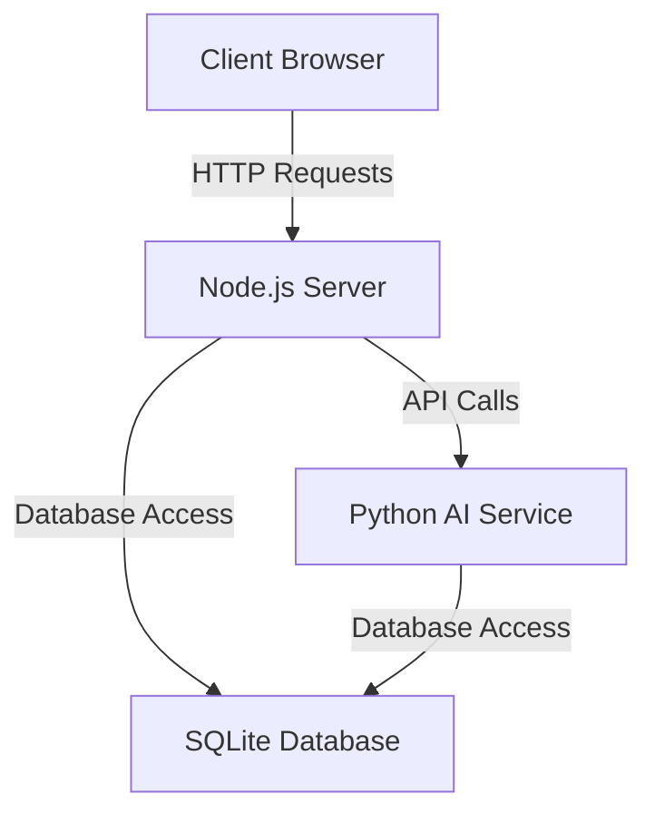

# Node.js Application Documentation

This document provides comprehensive documentation for the Node.js component of the Secure Express.js Authentication Application with AI Integration.

## 📋 Overview

The Node.js application serves as the main web server and API gateway for the application. It handles:

- **User Authentication**: JWT-based authentication system
- **API Routing**: RESTful API endpoints
- **Security**: Comprehensive security middleware
- **AI Integration**: Communication with Python AI microservice
- **Frontend Rendering**: EJS template rendering
- **Request Logging**: Comprehensive audit trail

## 🚀 Architecture

### Component Diagram



### Key Components

1. **Express.js Server**: Main web server (port 3000)
2. **Authentication System**: JWT token-based authentication
3. **Security Middleware**: CSP, sanitization, logging
4. **API Gateway**: Routes requests to appropriate handlers
5. **AI Proxy**: Forwards AI requests to Python service
6. **Database Interface**: SQLite database access

## 📁 Project Structure

```
tst2/
├── app.js                    # Main application file
├── bin/
│   └── www                   # Server entry point
├── config/
│   ├── app.db               # SQLite database
│   └── db.js                # Database configuration
├── controllers/
│   ├── authController.js    # Authentication logic
│   ├── aiController.js      # AI integration logic
│   └── adminController.js   # Admin functionality
├── middleware/
│   ├── authMiddleware.js    # Authentication middleware
│   ├── csp.js              # Content Security Policy
│   ├── optionalAuth.js     # Optional authentication
│   ├── requestLogger.js     # Request logging
│   └── sanitizer.js        # Input sanitization
├── routes/
│   ├── index.js            # Main routes
│   ├── users.js            # User-related routes
│   ├── ai_py_route.js      # AI integration routes
│   └── admin.js            # Admin routes
├── public/
│   ├── javascripts/        # Client-side JavaScript
│   └── stylesheets/        # Compiled CSS
├── styles/
│   └── input.css           # Tailwind CSS input
└── views/
    ├── components/         # EJS components
    ├── layouts/           # EJS layout templates
    └── *.ejs              # View templates
```

## 🔧 Core Functionality

### Authentication System

#### JWT Token Management

The application uses a dual-token system:

- **Access Token**: Short-lived (15 minutes) for API requests
- **Refresh Token**: Long-lived (7 days) for obtaining new access tokens

**Token Flow:**
1. User logs in with credentials
2. Server generates both tokens
3. Tokens stored in client localStorage
4. All requests include both tokens in headers
5. Server validates access token
6. If expired, uses refresh token to generate new tokens
7. Returns new tokens in response headers

#### Authentication Middleware

**`middleware/authMiddleware.js`:**
- Validates JWT tokens
- Handles token refresh automatically
- Sets user information on request object
- Returns 401 for invalid/expired tokens

**`middleware/optionalAuth.js`:**
- Extracts user info if available
- Doesn't fail for unauthenticated requests
- Used for logging and optional features

### Security Features

#### Content Security Policy (CSP)

**`middleware/csp.js`:**
- Implements strict CSP headers
- Blocks inline scripts and eval()
- Restricts external content loading
- Prevents clickjacking attacks

#### Input Sanitization

**`middleware/sanitizer.js`:**
- Uses `xss` library for sanitization
- Cleans all request inputs
- Prevents XSS attacks
- Handles HTML tag stripping

#### Request Logging

**`middleware/requestLogger.js`:**
- Logs all incoming requests
- Stores in SQLite database
- Includes IP, user agent, timestamp
- Provides audit trail for security

### API Gateway

#### Route Structure

- **`/`**: Main application routes
- **`/users`**: User authentication and management
- **`/ai`**: AI functionality endpoints
- **`/admin`**: Administrative functions

#### Key Endpoints

**Authentication:**
- `POST /users/login` - User login
- `POST /users/signup` - User registration
- `POST /users/logout` - User logout
- `GET /users/profile` - User profile (protected)

**AI Integration:**
- `POST /ai/api/ai-check` - Sentiment analysis (protected)
- `POST /ai/api/chat` - AI chat interface (protected)
- `GET /ai/dashboard` - AI dashboard page
- `GET /ai/chat` - AI chat page

**Admin:**
- `GET /admin/logs` - System request logs (protected)

### Database Interface

#### SQLite Configuration

**`config/db.js`:**
- Uses @libsql/client for Turso database access
- Implements WAL mode for concurrency
- Automatic schema migration
- Shared access with Python service

#### Database Schema

```sql
-- Users table
CREATE TABLE users (
  id INTEGER PRIMARY KEY,
  fullname TEXT NOT NULL,
  username TEXT NOT NULL UNIQUE,
  email TEXT NOT NULL UNIQUE,
  password TEXT NOT NULL,
  created_at TEXT NOT NULL,
  updated_at TEXT NOT NULL
);

-- Request logs table
CREATE TABLE request_logs (
  id INTEGER PRIMARY KEY,
  method TEXT NOT NULL,
  url TEXT NOT NULL,
  ip TEXT,
  user_agent TEXT,
  timestamp TEXT NOT NULL DEFAULT (datetime('now'))
);
```

### AI Integration

#### Python Service Proxy

The Node.js server acts as a proxy for the Python AI service:

1. **Request Forwarding**: Forwards AI requests to Python service
2. **Authentication**: Validates JWT tokens before forwarding
3. **Response Processing**: Returns results to client
4. **Error Handling**: Graceful fallbacks for service issues

#### AI Endpoints

- `POST /ai/api/ai-check` - Text sentiment analysis
- `POST /ai/api/chat` - Conversational AI
- Both endpoints require authentication
- Both forward requests to Python service

## 🛠️ Development Setup

### Prerequisites

- **Node.js**: Version 14 or higher
- **npm**: Version 6 or higher
- **Python**: Version 3.8 or higher (for AI service)

### Installation

```bash
# Install Node.js dependencies
npm install

# Set environment variables
cp .env.example .env
# Edit .env with your configuration

# Start development server
npm run dev
```

### Environment Variables

```bash
# Server
PORT=3000
NODE_ENV=development

# JWT Secrets (required; minimum 32 characters)
ACCESS_TOKEN_SECRET=your-development-access-token-secret-here
REFRESH_TOKEN_SECRET=your-development-refresh-token-secret-here

# Admin role (required for admin features)
ADMIN_ROLE_VALUE=1

# AI Service (Python microservice uses this)
OPENROUTER_API_KEY=your-openrouter-api-key-here

# MongoDB (only required if you use the masterrolls module)
MONGODB_URI=mongodb://localhost:27017/your_database_name

# RapidAPI (only required for GST lookup in inventory modules)
RAPIDAPI_KEY=your-rapidapi-key-here
```

## 🧪 Testing

### Manual Testing

1. **Start development server**: `npm run dev`
2. **Open browser**: Navigate to `http://localhost:3000`
3. **Test functionality**:
   - User registration and login
   - Dashboard access
   - Protected routes
   - Token refresh
   - AI features
   - Admin features

### API Testing

```bash
# Test login
curl -X POST http://localhost:3000/users/login \
  -H "Content-Type: application/json" \
  -d '{"username":"testuser","password":"password123"}'

# Test AI analysis
curl -X POST http://localhost:3000/ai/api/ai-check \
  -H "Authorization: Bearer <access_token>" \
  -H "X-Refresh-Token: <refresh_token>" \
  -H "Content-Type: application/json" \
  -d '{"message":"I love this application!"}'

# Test admin logs
curl -X GET http://localhost:3000/admin/logs \
  -H "Authorization: Bearer <access_token>" \
  -H "X-Refresh-Token: <refresh_token>"
```

## 🚀 Production Deployment

### Environment Variables

```bash
NODE_ENV=production
PORT=3000
JWT_SECRET=your-production-secret
JWT_REFRESH_SECRET=your-production-refresh-secret
DB_PATH=./config/app.db
OPENROUTER_API_KEY=your-openrouter-api-key
```

### Build Process

```bash
# Install production dependencies
npm ci --only=production

# Build CSS
npm run build:css

# Start production server
npm start
```

### Docker Deployment

```dockerfile
# Node.js Dockerfile
FROM node:18-alpine

WORKDIR /app

COPY package*.json ./
RUN npm ci --only=production

COPY . .

RUN npm run build:css

EXPOSE 3000
CMD ["npm", "start"]
```

## 🔐 Security Best Practices

### Development

1. **Never commit secrets** to version control
2. **Use environment variables** for configuration
3. **Validate all inputs** on both client and server
4. **Use HTTPS** in production
5. **Keep dependencies updated**

### Production

1. **Enable HTTPS** with valid certificates
2. **Implement rate limiting** for API endpoints
3. **Monitor logs** for suspicious activity
4. **Regular security audits** and updates
5. **Backup database** regularly

### Monitoring

1. **Log analysis** for unusual patterns
2. **Performance monitoring** for DoS attacks
3. **Security scanning** for vulnerabilities
4. **User activity tracking** for anomalies

## 📚 Dependencies

### Core Dependencies

- **express**: Web framework
- **ejs**: Template engine
- **jsonwebtoken**: JWT token handling
- **bcrypt**: Password hashing
- **@libsql/client**: Turso database access
- **xss**: Input sanitization
- **morgan**: Request logging

### Development Dependencies

- **nodemon**: Auto-restart server
- **concurrently**: Run multiple commands
- **tailwindcss**: CSS framework
- **ejs-mate**: Template inheritance

## 📖 API Documentation

See [API.md](API.md) for complete API documentation including:

- Authentication endpoints
- User management endpoints
- AI integration endpoints
- Admin endpoints
- Error handling
- Client-side implementation examples

## 🆘 Troubleshooting

### Common Issues

**Port Already in Use:**
```bash
lsof -i :3000
kill -9 <PID>
```

**Database Issues:**
```bash
rm config/app.db
rm config/app.db-shm
rm config/app.db-wal
```

**CSS Not Updating:**
```bash
npm run build:css
```

### Debug Tools

- **Node.js Inspector**: `node --inspect bin/www`
- **Browser DevTools**: For frontend debugging
- **Console Logging**: Use `console.log()` for debugging
- **VS Code Debugger**: Set breakpoints in code

## 📊 Performance Optimization

1. **CSS**: Use Tailwind's purge feature in production
2. **JavaScript**: Minimize client-side code
3. **Database**: Add indexes for frequently queried fields
4. **Caching**: Consider adding response caching
5. **AI Service**: Implement request queuing for high load

## 🔄 Contributing

### Code Style

- **JavaScript**: Follow existing patterns
- **CSS**: Use Tailwind classes
- **EJS**: Keep templates clean and organized
- **Comments**: Add comments for complex logic

### Git Workflow

1. **Create branch**: `git checkout -b feature/your-feature`
2. **Make changes**: Implement your feature
3. **Commit changes**: `git commit -m "Add your feature"`
4. **Push to origin**: `git push origin feature/your-feature`
5. **Create PR**: Open pull request on GitHub

## 📚 Additional Resources

### Core Technologies

- [Express.js Documentation](https://expressjs.com/)
- [Tailwind CSS Documentation](https://tailwindcss.com/)
- [EJS Documentation](https://ejs.co/)
- [bcrypt Documentation](https://www.npmjs.com/package/bcrypt)
- [jsonwebtoken Documentation](https://www.npmjs.com/package/jsonwebtoken)
- [better-sqlite3 Documentation](https://github.com/WiseLibs/better-sqlite3)

### Development Tools

- [Nodemon Documentation](https://nodemon.io/)
- [Concurrently Documentation](https://www.npmjs.com/package/concurrently)
- [Tailwind CLI Documentation](https://tailwindcss.com/docs/installation)

## 📋 Summary

The Node.js component provides the core web server functionality including:

- **Authentication**: JWT-based secure authentication
- **Security**: Comprehensive security middleware
- **API Gateway**: RESTful API endpoints
- **AI Integration**: Proxy to Python AI service
- **Frontend**: EJS template rendering
- **Database**: SQLite data storage

This component works in conjunction with the Python AI service to provide a complete, secure web application with AI capabilities.