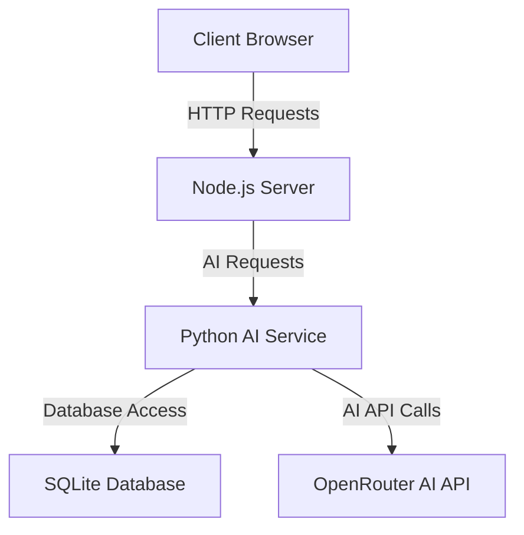

# Python AI Service Documentation

This document provides comprehensive documentation for the Python AI microservice component of the Secure Express.js Authentication Application.

## 📋 Overview

The Python AI service provides advanced AI capabilities including sentiment analysis and conversational AI. It serves as a microservice that the Node.js application communicates with via HTTP.

## 🚀 Architecture

### Component Diagram



### Key Components

1. **FastAPI Server**: RESTful API server (port 5200)
2. **AI Integration**: OpenRouter API communication
3. **Database Interface**: SQLite database access
4. **Request Processing**: AI prompt handling and response parsing
5. **Error Handling**: Graceful error recovery

## 📁 Project Structure

```
python_service/
├── main.py            # FastAPI application
├── chat_service.py    # Chat router and logic
├── db_client.py       # Database client
├── venv/              # Python virtual environment
├── requirements.txt   # Python dependencies
└── .env               # Environment variables
```

## 🤖 Core Functionality

### FastAPI Server

**`main.py`:**
- FastAPI application setup
- API endpoint definitions
- Request/response handling
- Error management

### AI Integration

#### OpenRouter API

The service uses OpenRouter for AI model access:

```python
# Setup OpenRouter Client
client = OpenAI(
    base_url="https://openrouter.ai/api/v1",
    api_key=API_KEY
)
```

#### Supported Models

- **kwaipilot/kat-coder-pro:free**: Default model for analysis
- **Other OpenRouter models**: Can be configured as needed

### Database Interface

**`db_client.py`:**
- SQLite database access
- Shared database with Node.js service
- Request log retrieval
- Thread-safe connection handling

### AI Endpoints

#### GET /

Health check endpoint:

```python
@app.get("/")
def read_root():
    return {"status": "Python AI Service is Running"}
```

#### POST /analyze

Text sentiment analysis:

```python
@app.post("/analyze")
def analyze_text(data: DataInput):
    # AI analysis logic
    # Returns sentiment analysis result
```

**Request Body:**
```json
{
    "text": "string"
}
```

**Response:**
```json
{
    "analysis_result": "Positive|Negative|Neutral",
    "confidence_score": 0.0-1.0,
    "original_text": "string"
}
```

#### POST /chat

Conversational AI interface:

```python
@app.post("/chat")
def chat_with_ai(chat_request: ChatRequest):
    # AI chat logic
    # Returns chat response
```

**Request Body:**
```json
{
    "history": [
        {
            "role": "system|user|assistant",
            "content": "string"
        }
    ],
    "message": "string"
}
```

**Response:**
```json
{
    "reply": "string",
    "success": true
}
```

#### GET /logs

System log retrieval:

```python
@app.get("/logs")
def get_system_logs():
    return db_client.fetch_logs()
```

## 🛠️ Development Setup

### Prerequisites

- **Python**: Version 3.8 or higher
- **pip**: Python package manager
- **Virtual Environment**: Recommended for isolation

### Installation

```bash
# Navigate to Python service directory
cd python_service

# Create virtual environment
python -m venv venv

# Activate virtual environment
source venv/bin/activate  # Linux/Mac
# or
venv\Scripts\activate     # Windows

# Install dependencies
pip install fastapi uvicorn openai python-dotenv

# Set environment variables
cp .env.example .env
# Edit .env with your OpenRouter API key

# Start development server
uvicorn main:app --reload --port 5200
```

### Environment Variables

```bash
# OpenRouter API Key
OPENROUTER_API_KEY=your-openrouter-api-key-here

# Database (optional, defaults to ../config/app.db)
DB_PATH=../config/app.db
```

## 🧪 Testing

### Manual Testing

1. **Start Python service**: `uvicorn main:app --reload --port 5200`
2. **Test endpoints** using curl or Postman
3. **Verify responses** for correctness
4. **Test error handling** with invalid inputs

### API Testing

```bash
# Health check
curl http://localhost:5200/

# AI Analysis
curl -X POST http://localhost:5200/analyze \
  -H "Content-Type: application/json" \
  -d '{"text":"I love this application!"}'

# Chat
curl -X POST http://localhost:5200/chat \
  -H "Content-Type: application/json" \
  -d '{"message":"Hello", "history":[]}'

# Logs
curl http://localhost:5200/logs
```

### Integration Testing

Test the complete flow from Node.js through Python service:

```bash
# Test through Node.js proxy
curl -X POST http://localhost:3000/ai/api/ai-check \
  -H "Authorization: Bearer <access_token>" \
  -H "X-Refresh-Token: <refresh_token>" \
  -H "Content-Type: application/json" \
  -d '{"message":"I love this application!"}'
```

## 🚀 Production Deployment

### Environment Variables

```bash
OPENROUTER_API_KEY=your-production-openrouter-api-key
DB_PATH=../config/app.db
```

### Build Process

```bash
# Create virtual environment
python -m venv venv

# Activate virtual environment
source venv/bin/activate

# Install production dependencies
pip install fastapi uvicorn openai python-dotenv

# Start production server
uvicorn main:app --port 5200
```

### Docker Deployment

```dockerfile
# Python Dockerfile
FROM python:3.9-slim

WORKDIR /app

COPY requirements.txt ./
RUN pip install --no-cache-dir -r requirements.txt

COPY . .

EXPOSE 5200
CMD ["uvicorn", "main:app", "--host", "0.0.0.0", "--port", "5200"]
```

## 🔐 Security Features

### API Key Management

- **Environment Variables**: API keys stored securely
- **No Hardcoding**: Keys never committed to version control
- **Load Balancing**: Uses OpenRouter for redundancy

### Input Validation

- **Pydantic Models**: Type-safe input validation
- **JSON Parsing**: Secure JSON handling
- **Content Filtering**: AI response validation

### Database Security

- **Shared Database**: Secure access to main database
- **Thread Safety**: SQLite connection configured for concurrency
- **Path Resolution**: Secure path calculation

### Error Handling

- **Graceful Fallbacks**: Returns safe defaults on errors
- **No Information Leakage**: Generic error messages
- **Logging**: Errors logged for debugging

## 🧠 AI Implementation Details

### Sentiment Analysis

The sentiment analysis endpoint uses a structured approach:

1. **System Prompt**: Forces JSON-only responses
2. **User Prompt**: Contains text to analyze
3. **AI Processing**: OpenRouter model analysis
4. **Response Parsing**: JSON extraction and validation
5. **Fallback**: Safe defaults on errors

**System Prompt:**
```
You are an API that analyzes sentiment.
You MUST respond with valid JSON only. No markdown, no explanations.
Format:
{
    "analysis_result": "Positive" | "Negative" | "Neutral",
    "confidence_score": 0.0 to 1.0,
    "summary": "A 5-word summary of the text"
}
```

### Chat Interface

The chat interface supports conversational context:

1. **History Tracking**: Maintains conversation context
2. **Role Management**: System, user, assistant roles
3. **Context Injection**: Adds system instructions
4. **Response Formatting**: Clean response extraction

### Error Handling

Comprehensive error handling for AI operations:

```python
try:
    # AI processing
    response = client.chat.completions.create(...)
    # Response parsing
except Exception as e:
    print(f"AI Error: {e}")
    # Fallback response
    return {
        "analysis_result": "Error",
        "confidence_score": 0.0,
        "original_text": data.text
    }
```

## 📚 Dependencies

### Core Dependencies

- **fastapi**: Web framework
- **uvicorn**: ASGI server
- **openai**: OpenAI API client
- **python-dotenv**: Environment variables
- **pydantic**: Data validation

### Development Dependencies

- **python**: Python runtime
- **pip**: Package manager
- **virtualenv**: Environment isolation

## 📖 API Documentation

### Endpoints

| Method | Endpoint | Description | Authentication |
|--------|----------|-------------|----------------|
| GET | `/` | Health check | None |
| POST | `/analyze` | Sentiment analysis | Required |
| POST | `/chat` | Conversational AI | Required |
| GET | `/logs` | System logs | Required |

### Request/Response Examples

#### Health Check

**Request:**
```bash
GET http://localhost:5200/
```

**Response:**
```json
{
    "status": "Python AI Service is Running"
}
```

#### Sentiment Analysis

**Request:**
```bash
POST http://localhost:5200/analyze
Content-Type: application/json

{
    "text": "I love this application!"
}
```

**Response:**
```json
{
    "analysis_result": "Positive",
    "confidence_score": 0.95,
    "original_text": "I love this application!"
}
```

#### Chat Interface

**Request:**
```bash
POST http://localhost:5200/chat
Content-Type: application/json

{
    "history": [],
    "message": "Hello"
}
```

**Response:**
```json
{
    "reply": "Hello! How can I assist you today?",
    "success": true
}
```

#### System Logs

**Request:**
```bash
GET http://localhost:5200/logs
```

**Response:**
```json
{
    "success": true,
    "logs": [
        {
            "id": 1,
            "method": "POST",
            "url": "/analyze",
            "ip": "127.0.0.1",
            "timestamp": "2024-01-01T00:00:00.000Z"
        }
    ]
}
```

## 🆘 Troubleshooting

### Common Issues

**Port Already in Use:**
```bash
lsof -i :5200
kill -9 <PID>
```

**Missing Dependencies:**
```bash
pip install -r requirements.txt
```

**API Key Issues:**
```bash
# Check .env file
cat .env
# Verify API key format
```

**Database Connection Issues:**
```bash
# Check database path
ls -la ../config/app.db
# Verify permissions
```

### Debug Tools

- **Python Debugger**: `python -m pdb main.py`
- **FastAPI Docs**: `http://localhost:5200/docs` (auto-generated)
- **Console Logging**: Use `print()` for debugging
- **VS Code Debugger**: Set breakpoints in Python code

## 📊 Performance Optimization

1. **Connection Pooling**: Consider for high-load scenarios
2. **Caching**: Cache frequent AI responses
3. **Rate Limiting**: Implement for API protection
4. **Batch Processing**: For multiple requests
5. **Model Selection**: Choose appropriate AI models

## 🔄 Contributing

### Code Style

- **Python**: Follow PEP 8 style guide
- **Type Hints**: Use Python type hints
- **Docstrings**: Add docstrings for functions
- **Comments**: Add comments for complex logic

### Git Workflow

1. **Create branch**: `git checkout -b feature/your-feature`
2. **Make changes**: Implement your feature
3. **Commit changes**: `git commit -m "Add your feature"`
4. **Push to origin**: `git push origin feature/your-feature`
5. **Create PR**: Open pull request on GitHub

## 📚 Additional Resources

### Core Technologies

- [FastAPI Documentation](https://fastapi.tiangolo.com/)
- [OpenRouter API Documentation](https://openrouter.ai/docs)
- [OpenAI API Documentation](https://platform.openai.com/docs/)
- [Pydantic Documentation](https://pydantic-docs.helpmanual.io/)

### Python Development

- [Python Documentation](https://docs.python.org/3/)
- [Python Security Best Practices](https://python-security.readthedocs.io/)
- [FastAPI Security Documentation](https://fastapi.tiangolo.com/advanced/security/)

### AI Resources

- [OWASP AI Security Top 10](https://owasp.org/www-project-top-10-for-large-language-model-applications/)
- [AI Prompt Injection Prevention](https://github.com/centerforaianddigitalpolicy/prompt-injection)
- [Secure AI Development Guidelines](https://github.com/trailofbits/ai-sec-guidelines)

## 📋 Summary

The Python AI service provides:

- **AI Capabilities**: Sentiment analysis and conversational AI
- **RESTful API**: FastAPI-based web service
- **Security**: API key management and input validation
- **Integration**: Seamless communication with Node.js server
- **Database**: Shared SQLite database access
- **Error Handling**: Graceful error recovery

This microservice works in conjunction with the Node.js application to provide a complete, secure web application with advanced AI capabilities.

## 🔄 Integration with Node.js

### Communication Flow

1. **Client Request**: Browser sends request to Node.js
2. **Authentication**: Node.js validates JWT tokens
3. **Request Forwarding**: Node.js forwards to Python service
4. **AI Processing**: Python service processes request
5. **Response**: Python service returns result to Node.js
6. **Client Response**: Node.js returns result to browser

### Security Considerations

- **Authentication**: All requests to Python service go through Node.js
- **Input Validation**: Both services validate inputs
- **Error Handling**: Graceful fallbacks for service issues
- **Logging**: Both services log requests for audit trail

### Performance Optimization

- **Connection Reuse**: Maintain persistent connections
- **Caching**: Implement caching for frequent requests
- **Load Balancing**: Consider multiple Python instances
- **Rate Limiting**: Protect against abuse

This Python AI service is a critical component that provides the AI capabilities for the overall application while maintaining security and reliability.